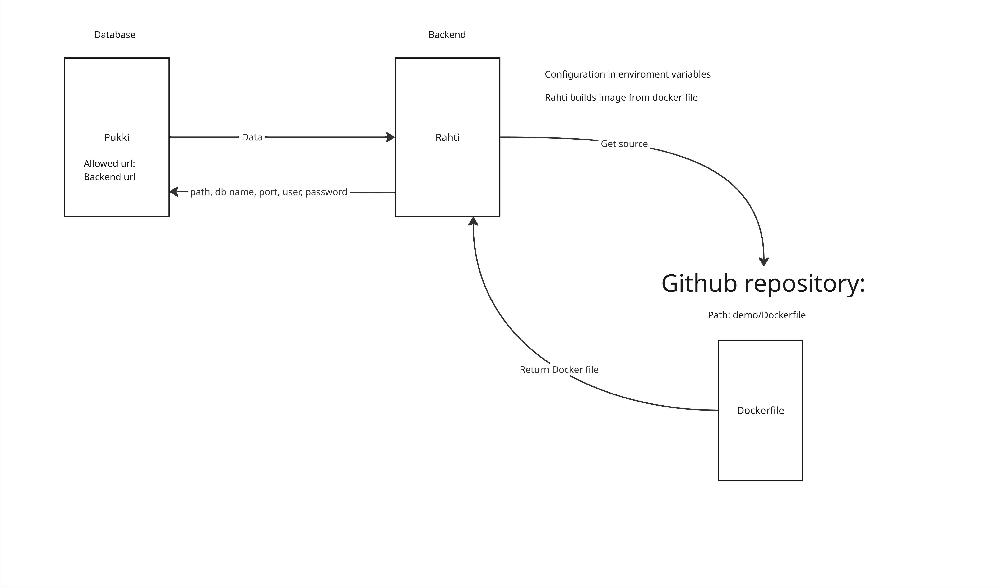

# rahti-demo

🇫🇮 **Suomeksi** | 🇬🇧 [In English](README.en.md)

## Johdanto

Tämän repositorion tarkoituksena on selventää Rahti-konttialustaan ja sovelluksen julkaisuun liittyviä käytäntöjä. Projekti tarjoaa esimerkit Dockerfilestä, Javan kerrosarkkitehtuurista, tarvittavista riippuvuuksista sekä kehitystä helpottavista npm-skripteistä, jotka sijaitsevat projektin juuressa. Repository tukeutuu [Haaga-Helian Rahti-ohjeisiin](https://github.com/software-development-project-1/software-development-project-1.github.io/blob/main/material/backend-deployment.md).

## Docker

Projektia varten tarvitset koneellesi Dockerin, jotta voit rakentaa Dockerfilen pohjalta konttikuvan (_image_). Konttikuva toimii suoritettavan kontin pohjana ja sitä voi ajatella reseptinä tai mallina ajettavalle kontille. Dockerin voit asentaa [Dockerin virallisilta sivuilta](https://docs.docker.com/desktop/).

Docker-komentoja ei tarvitse ajaa manuaalisesti komentoriviltä, sillä projektin juuressa olevat npm-skriptit suorittavat ne puolestasi paikallista kehitystä ja testausta varten.

> **Huom:** Windowsilla Docker Desktopin on oltava käynnissä, jotta Docker-komennot toimivat.

## Paikallinen kehitysympäristö ja testaus

Dockerin ja konttien avulla voit testata sovellusta paikallisesti. Testiympäristö on rakennettu vastaamaan Rahti-tuotantoympäristöä, ja se koostuu kahdesta kontista:

- **PostgreSQL-kontti** (tietokanta)
- **Java-kontti** (backend-palvelu)

Backendin konttikuva rakennetaan [demo/Dockerfile](demo/Dockerfile) -tiedoston pohjalta. Tietokannan PostgreSQL-konttikuva haetaan suoraan Docker Hub -rekisteristä.

Paikallinen ympäristö pystytetään seuraavasti:

1. Luodaan konteille yhteinen virtuaaliverkko (`demo-net`).
2. Käynnistetään tietokantakontti (`postgres-db`) `demo-net`-verkkoon ja asetetaan tietokannan ympäristömuuttujat (`-e` / _environment variables_).
3. Käynnistetään backend-kontti samaan `demo-net`-verkkoon, jolloin backend ja tietokanta löytävät toisensa verkon sisäisillä nimillä. Backendille välitetään tarvittavat ympäristömuuttujat tietokantayhteyden muodostamiseksi.

### npm komennot

#### build:app:image

Rakentaa Dockerfilen pohjalta imagen backend-sovellukselle paikallista tai julkaisuympäristön ajoa varten.

```bash
npm run build:app:image
```

#### docker:network:local

Luo `demo-net`-Docker-virtuaaliverkon, jonka avulla tietokanta- ja sovelluskontti voivat kommunikoida keskenään nimipohjaisesti.

```bash
npm run docker:network:local
```

#### docker:postgresql:local

Käynnistää PostgreSQL 16 -kontin taustalle `demo-net`-verkkoon paikallista testausta varten.

```bash
npm run docker:postgresql:local
```

#### docker:app:local

Käynnistää backend-kontin `demo-net`-verkkoon, asettaa tarvittavat ympäristömuuttujat ja ohjaa portin `8080` isäntäkoneelle.

```bash
npm run docker:app:local
```

#### dev

Käynnistää koko paikallisen kehitys- ja testausympäristön suorittamalla järjestyksessä verkon luonnin, tietokannan käynnistyksen ja backend-sovelluksen.

```bash
npm run dev
```

#### clean:local

Pysäyttää ja poistaa paikallisen `postgres-db`-kontin sekä poistaa `demo-net`-verkon siivoten testiympäristön resurssit.

```bash
npm run clean:local
```

## Rahti ja Pukki

### Kokonaiskuva ja arkkitehtuuri

Tuotantoympäristössä sovelluksen ajo perustuu CSC:n Rahti-konttialustaan ja Pukki-tietokantapalveluun.



#### Toimintaperiaate:

1. **Lähdekoodi ja Dockerfile (GitHub):** Rahdille määritellään GitHub-repository ja suhteellinen polku Dockerfileen (`demo/Dockerfile`).
2. **Automaattinen rakennus (Rahti):** Rahti noutaa koodin repositoriosta ja rakentaa automaattisesti suoritettavan Docker-imagen.
3. **Konfigurointi ympäristömuuttujilla:** Backend-kontti käynnistetään Rahdissa ja sille annetaan tarvittavat ympäristömuuttujat (kuten tietokantatunnukset ja aktiivinen Spring-profiili).
4. **Pukki-tietokanta:** Tietokantana toimii Pukki-palvelun hallinnoitu PostgreSQL-kanta. Pukkiin määritellään sallitut verkko-osoitteet (_Allowed URL / IP_), jotta vain Rahdissa pyörivä backend pääsee käsiksi tietokantaan.

#### Muuta

Pukki tietokannan Allowed CIDR: 86.50.229.150/32

---

## Ympäristömuuttujat (Environment Variables)

Ympäristömuuttujien avulla sovelluksen konfiguraatiot ja salaisuudet erotetaan lähdekoodista (_12-Factor App_ -periaatteen mukaisesti). Tällöin samaa sovelluskuvaa (Docker image) voidaan ajaa eri ympäristöissä ilman koodimuutoksia tai uudelleenrakennusta.

### Konfiguraatiot ja profiilit

Sovelluksessa on määritelty eri profiilit eri ajotilanteita varten:

- **`dev` (Kehitysympäristö - [application-dev.yaml](demo/src/main/resources/application-dev.yaml)):**
  - Käyttää nopeaa H2-muistitietokantaa (`jdbc:h2:mem:devdb`).
  - Ei vaadi ulkoista tietokantapalvelinta tai erillisiä salasanoja.
  - Aktivoituu automaattisesti oletuksena.

- **`prod` (Tuotanto ja kontitettu testaus - [application-prod.yaml](demo/src/main/resources/application-prod.yaml)):**
  - Käyttää PostgreSQL-ajuria ja lukee yhteyden parametrit dynaamisesti ympäristömuuttujista.

### Käytettävät ympäristömuuttujat

| Ympäristömuuttuja        | Kuvaus                                  | Esimerkki (Paikallinen / Docker) | Esimerkki (Rahti & Pukki) |
| :----------------------- | :-------------------------------------- | :------------------------------- | :------------------------ |
| `SPRING_PROFILES_ACTIVE` | Aktivoitava Spring-profiili             | `prod`                           | `prod`                    |
| `DB_HOST`                | Tietokantapalvelimen osoite/isäntänimi  | `postgres-db` (kontin nimi)      | `pukki-db-host.csc.fi`    |
| `DB_PORT`                | Tietokannan portti                      | `5432`                           | `5432`                    |
| `DB_NAME`                | Tietokannan nimi                        | `demodb`                         | `demodb`                  |
| `DB_USERNAME`            | Tietokannan käyttäjätunnus              | `postgres`                       | `pukki_kayttaja`          |
| `DB_PASSWORD`            | Tietokannan salasana                    | `secret`                         | _(Salainen salasana)_     |

### Miksi ympäristömuuttujia käytetään?

1. **Tietoturva:** Salasanoja, tunnuksia tai tuotanto-osoitteita ei tallenneta GitHubiin tai Dockerfileen.
2. **Siirrettävyys:** Sama Docker-image toimii sellaisenaan paikallisessa kehityskoneessa, testauspalvelimella ja Rahdissa vain ympäristömuuttujia vaihtamalla.
3. **Ylläpidettävyys:** Tietokannan osoitteen tai salasanan vaihtuessa sovellusta ei tarvitse kääntää tai paketoida uudelleen – riittää, että kontin ympäristömuuttujat päivitetään.
